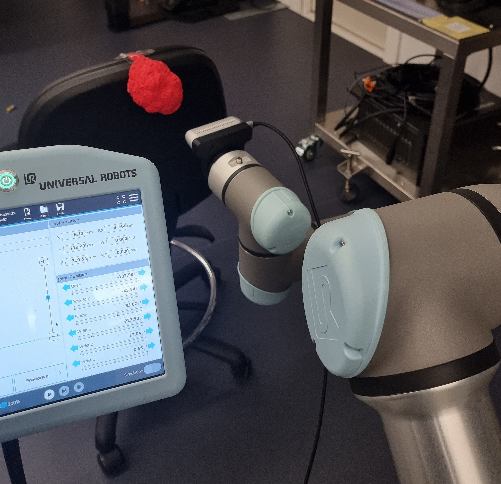
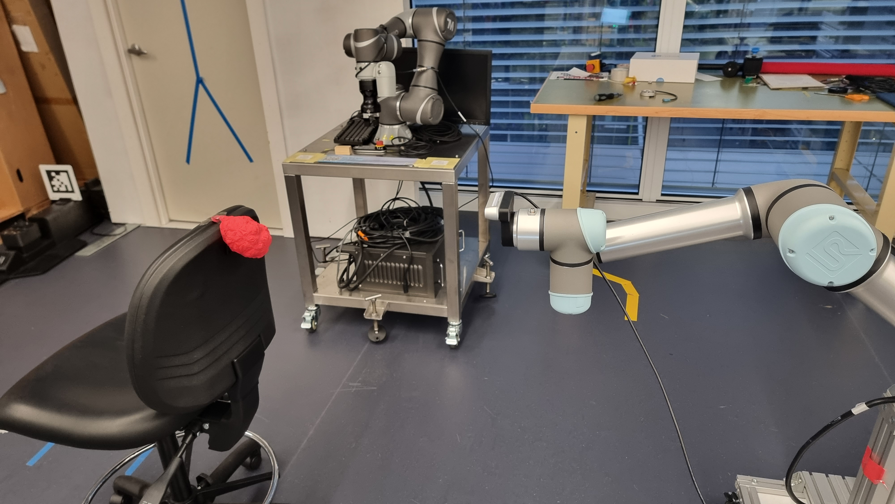

# Arm Module UR5e
The repo is a ROS meta package that contains the following packages:
- [arm_module_ur5e_controller](README.md#arm-module-ur5-controller)
- [arm_module_ur5e_description](README.md#arm-module-ur5e-description)
- [arm_module_gazebo](README.md#arm-module-gazebo)
- [arm_module_ur5e_moveit_config](README.md#arm-module-ur5e-moveit-config)

Check out the [launch instruction](README.md#launching). 

Explanation of the launch file structure by UR - [wiki](wiki\launch_files_instructions.md)

# MVPS Integration
This project integrates with MVPS - private repo, which is an active perception pipeline for reconstruction. 
The package provides predefined pose goals for the robot arm to position the optical lense of the camera. 
There are two recorded sets of poses for two scenarios, for a near and a far position of the constructed object with 
respect to the camera:

<p align="center">
  <div style="display: flex; justify-content: center; align-items: center;">
    <figure style="margin: 0 10px; text-align: center;">
      
      <figcaption style="margin-top: 5px;">Constructed object near camera</figcaption>
    </figure>
    <figure style="margin: 0 10px; text-align: center;">
      
      <figcaption style="margin-top: 5px;">Constructed object a bit farther from camera</figcaption>
    </figure>
  </div>
</p>

There are 9 poses in each scenarios, dividing the vertical apple trellis into a 3x3 grid:

<p align="center">
    
</p>

Images are named `(Far/Near)_location_number.jpg` and stored in wiki/images as [camera_near_object](images/camera_near_object) and [camera_far_object](images/camera_far_object)

Each of them has a corresponding json config file that lists the poses, they will be parsed to get pose goals, which will be send to the manipulator controller:
- [list_poses_camera_near_object.json](..\cfg\list_poses_camera_near_object.json)
- [list_poses_camera_far_object.json](..\cfg\list_poses_camera_far_object.json)


# Arm Module UR5 Controller
**Directory: arm_module_ur5e_controller**

Used for setting up the UR5e manipulator using Universal Robot ROS Driver and MoveIt
- [Setup guide](wiki/setup.md#dependency)
- [Docker](wiki/setup.md#docker)
- [Resources](wiki/resource.md)

## Codebase Structure
- `cpp` codebase in cpp (Python code maybe be ported to cpp for performance in the end). Not yet developed, only has scratch files 
- `python` code base in Python, using MoveIt Python API
    - `src` libraries
        - `collision_manager.py`, `gripper.py` extra settings for controller, not used for now
        - `UR5e.py` robot main planner and controller, using MoveIt
        - `utility.py`
    - `scripts` executables to run ROS nodes 
        - `run_robot_controller.py` ROS node to coordinate the mission of the robot, operate on an instance of the UR5e controller. For testing purposes, it can either:
            - Directly read a json file of poses and controll the robot to reach those goals
            - Receive goals one by one through service call, complete them sequentially
        - `move_robot_client.py` ROS client to make service call that sends pose goals to the controller
        - `fake pose service.py` – ROS client that mimics the behaviour of the real
        pose service for testing purposes.
        - `query current pose.py` – ROS client to query current pose – for testing.       
- `launch` ROS launch files to launch a custom robot (UR5e with added gripper, base, camera, etc). Not yet developed, only has scratch files 
- `srv` set up ROS service
- `urdf` custom URDF to add camera, based, etc. Not yet developed, only has scratch files 
- `docker` Docker setup the package

## Important Notes
```bash
move_group = MoveGroupCommander("manipulator")
move_group.get_current_pose()
```

get_current_pose() returns pose in base_link frame, while in UR teach pendant Move tab, frame Base shows XYZRPY in base frame

In CHANGELOG.rst:
"Note that 'base' is essentially 'base_link' but rotated by 180
  degrees over the Z-axis. This is necessary as the visual and
  collision geometries appear to also have their origins rotated
  180 degrees wrt the real robot."


# Arm Module UR5e Description
## Extrinsic Calibration
### UR5e Coordinate Frames
<p align="center">
  <div style="display: flex; justify-content: center; align-items: center;">
    <figure style="margin: 0 10px; text-align: center;">
      
      <figcaption style="margin-top: 5px;">UR5e base coordinate system</figcaption>
    </figure>
    <figure style="margin: 0 10px; text-align: center;">
      
      <figcaption style="margin-top: 5px;">UR5e tool coordinate system</figcaption>
    </figure>
  </div>
</p>

### Realsense D435 Frames
### D435 Mount
<p align="center">
    
</p>

### Robot Model 
<p align="center">
    
</p>

### Launch only the Realsense D435 model in Gazebo
roslaunch realsense2_description view_d435_model.launch


# Arm Module Gazebo
<p align="center">
    
</p>


# Arm Module UR5e Moveit Config
Generated by MoveIt Setup Assistant, this package configures MoveIt for motion planning with the UR5e, providing the necessary
files for defining planning groups, constraints, and motion planning parameters.


# Launching
The launch file structure in this package mimics the UR robot ROS Wrapper ([universal_robot](https://github.com/ros-industrial/universal_robot)) launch files and urdf structure, creating a corresponding version for each of the original one and modify as necessary to include the base, camera, etc.

## 1.1 UR5 model with Base
### Gazebo
Modify launch files and urdf to add the base of the robot arm (in UTS:RI lab it is a pillar)

If you include the pointcloud_normals nodelet, you need to build and source the MVPS package
```bash
roslaunch arm_module_gazebo arm_module_ur5e_bringup.launch
```

Starting up RViz with a configuration including the MoveIt! Motion Planning plugin
```bash
roslaunch arm_module_ur5e_moveit_config moveit_planning_execution.launch sim:=true
```

### Real Hardware
Configure the UR software in the teach pendant
- Find your computer's IP
- Add that IP to Installation/URCap
- Add new program in Program/URCap

Start the robot driver. To check robot IP, use the teach pendant, go to Settings/System/Network
```bash
roslaunch ur_robot_driver ur5e_bringup.launch robot_ip:=150.22.0.93 robot_description_file:=$(rospack find arm_module_gazebo)/launch/inc/load_ur5e_pillar_camera.launch.xml
```

Launch UR5e MoveIt config
```bash
roslaunch arm_module_ur5e_moveit_config moveit_planning_execution.launch
```

## 1.2 UR5 without Base (Alternative)
This is the default launch set up provided by the original universal_robot package

<details><summary><b>Show</b></summary>

### Gazebo
Bring up the simulated robot in Gazebo
```bash
roslaunch ur_gazebo ur5e_bringup.launch
```

### Real Hardware
Similar to launching with the Base, now without supplying the urdf for robot_description
```bash
roslaunch ur_robot_driver ur5e_bringup.launch robot_ip:=192.168.0.169
```

Launch UR5e MoveIt config
```bash
roslaunch arm_module_ur5e_moveit_config moveit_rviz.launch
```

### Motion Planning
Turn on the MoveIt! nodes to allow motion planning
```bash
roslaunch arm_module_ur5e_moveit_config moveit_planning_execution.launch sim:=true
```

Start up RViz with a configuration including the MoveIt! Motion Planning plugin
```bash
roslaunch arm_module_ur5e_moveit_config moveit_rviz.launch
```
</details>

## 2. Launch the controller
Choose the demo mode in `arm_module_ur5e_controller/cfg/arm_module_controller_config.yaml`
- Mode 1: Controller script acts as a service server. Use service call to supply goal pose to it
- Mode 2: Launch the test node to go through a set of waypoints in `cfg/list_poses.json`
- Mode 3: MVPS integration. Read a list of poses from `cfg/near_q_list_sim_deg.yaml`, reach goal poses one by one,
use service call to signal moving next pose of that list

```bash
rosrun arm_module_ur5e_controller run_robot_controller.py
```

## Launch Camera Module only (Testing Mode)
Includes the RealSense camera looking at a chair 3D model
```bash
roslaunch arm_module_gazebo test_realsense.launch
```

## Launching UR5e + Base (Dinh Bach)
Use this launch file instead of arm_module_ur5e_bringup.launch, the other launch files remain the same
```bash
roslaunch arm_module_gazebo ur5e_base_camera.launch
```