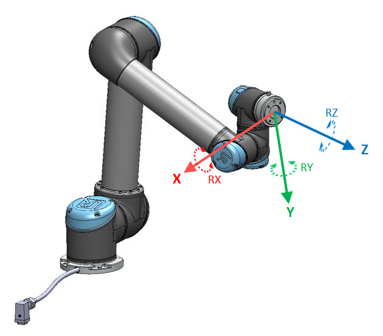
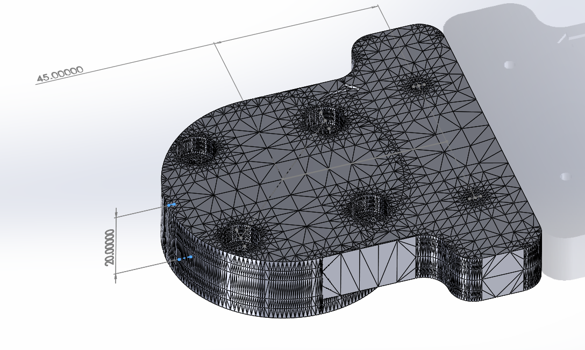

# Extrinsic Calibration
## UR5e Coordinate Frames

  

    <figure style="margin: 0 10px; text-align: center;">
      
      <figcaption style="margin-top: 5px;">UR5e base coordinate system</figcaption>
    </figure>
    <figure style="margin: 0 10px; text-align: center;">
      
      <figcaption style="margin-top: 5px;">UR5e tool coordinate system</figcaption>
    </figure>
  

## D435 Mount

    

