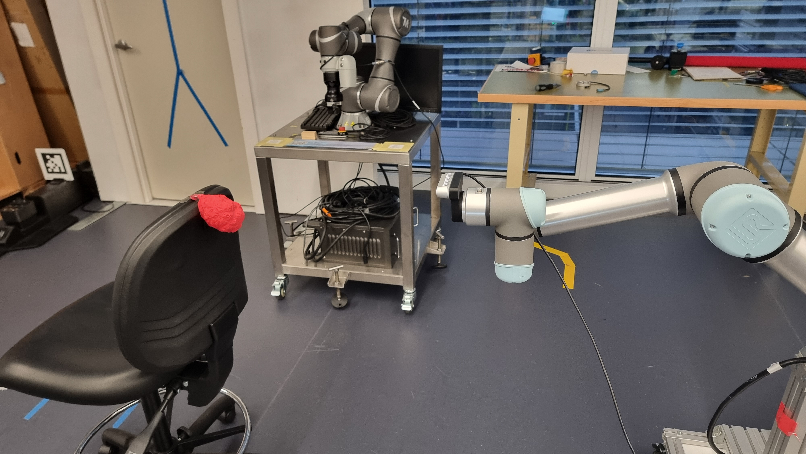

# MVPS Integration 
The package provides predefined pose goals for the robot arm to position the optical lense of the camera. 
There are two recorded sets of poses for two scenarios, for a near and a far position of the constructed object with 
respect to the camera:

  

    <figure style="margin: 0 10px; text-align: center;">
      
      <figcaption style="margin-top: 5px;">Constructed object near camera</figcaption>
    </figure>
    <figure style="margin: 0 10px; text-align: center;">
      
      <figcaption style="margin-top: 5px;">Constructed object a bit farther from camera</figcaption>
    </figure>
  

There 9 poses in each scenarios, dividing the vertical apple trellis into a 3x3 grid:

    

Images are named `(Far/Near)_location_number.jpg` and stored in wiki/images as [camera_near_object](images/camera_near_object) and [camera_far_object](images/camera_far_object)

Each of them has a corresponding json config file that lists the poses, they will be parsed to get pose goals, which will be send to the manipulator controller:
- [list_poses_camera_near_object.json](..\cfg\list_poses_camera_near_object.json)
- [list_poses_camera_far_object.json](..\cfg\list_poses_camera_far_object.json)